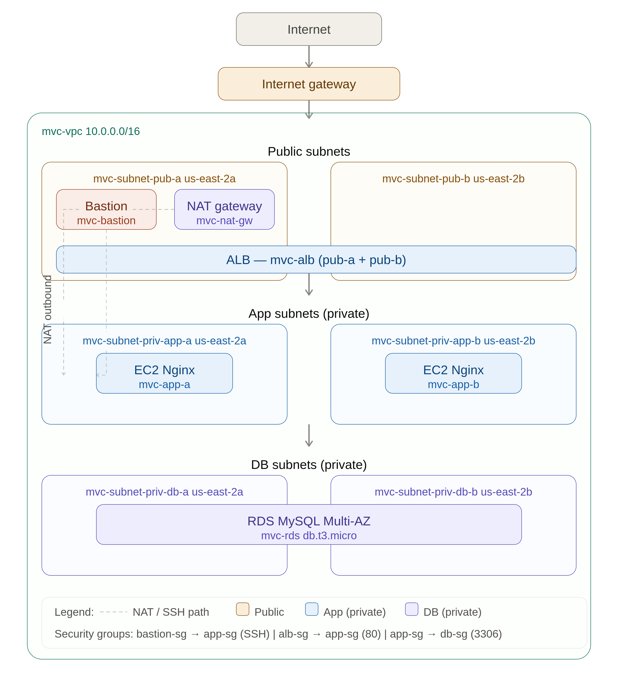

# AWS Multi-Tier VPC

A production-grade three-tier VPC architecture deployed on AWS using native Terraform resources. No community modules — every resource is written directly to demonstrate understanding of the underlying infrastructure.

## Architecture



The architecture provisions a VPC across two availability zones with three distinct tiers:

- Public subnets host the Application Load Balancer, a NAT Gateway for outbound private subnet traffic, and a bastion host for SSH access
- Private app subnets host two EC2 instances running Nginx, reachable only via the ALB or bastion
- Private DB subnets host a Multi-AZ RDS MySQL instance, reachable only from the app tier

## Stack

| Layer | Technology |
|---|---|
| IaC | Terraform (native resources only) |
| Compute | EC2 t2.micro (Amazon Linux 2023) |
| Load balancer | Application Load Balancer |
| Database | RDS MySQL 8.0 (db.t3.micro, Multi-AZ) |
| Networking | VPC, subnets, IGW, NAT Gateway, route tables |
| Access | Bastion host, security group chaining |
| Region | us-east-2 |

## Resources

| Resource | Name | Description |
|---|---|---|
| VPC | mvc-vpc | 10.0.0.0/16, DNS hostnames enabled |
| Subnet | mvc-subnet-pub-a | Public, us-east-2a, 10.0.1.0/24 |
| Subnet | mvc-subnet-pub-b | Public, us-east-2b, 10.0.2.0/24 |
| Subnet | mvc-subnet-priv-app-a | Private, us-east-2a, 10.0.3.0/24 |
| Subnet | mvc-subnet-priv-app-b | Private, us-east-2b, 10.0.4.0/24 |
| Subnet | mvc-subnet-priv-db-a | Private, us-east-2a, 10.0.5.0/24 |
| Subnet | mvc-subnet-priv-db-b | Private, us-east-2b, 10.0.6.0/24 |
| Internet Gateway | mvc-igw | Attached to mvc-vpc |
| NAT Gateway | mvc-nat-gw | Deployed in pub-a, EIP attached |
| Bastion | mvc-bastion | SSH access from authorized IP only |
| ALB | mvc-alb | HTTP listener, forwards to app tier |
| EC2 | mvc-app-a | Nginx, private app subnet us-east-2a |
| EC2 | mvc-app-b | Nginx, private app subnet us-east-2b |
| RDS | mvc-rds | MySQL 8.0, Multi-AZ, private DB subnets |

## Security Groups

| Group | Inbound |
|---|---|
| mvc-sg-bastion | SSH (22) from authorized IP only |
| mvc-sg-alb | HTTP (80), HTTPS (443) from anywhere |
| mvc-sg-app | HTTP (80) from alb-sg, SSH (22) from bastion-sg |
| mvc-sg-db | MySQL (3306) from app-sg only |

All security groups allow unrestricted outbound.

## Terraform Module

Subnet creation is abstracted into a reusable module under `modules/subnet-tier/`. The module accepts a map of subnet definitions and provisions each subnet via `for_each`, outputting a map of subnet IDs for use by downstream resources.

```hcl
module "subnets" {
  source = "./modules/subnet-tier"

  vpc_id = aws_vpc.mvc.id

  subnets = {
    pub_a      = { cidr = "10.0.1.0/24", az = "us-east-2a", public_ip = true,  name = "mvc-subnet-pub-a"      }
    pub_b      = { cidr = "10.0.2.0/24", az = "us-east-2b", public_ip = true,  name = "mvc-subnet-pub-b"      }
    priv_app_a = { cidr = "10.0.3.0/24", az = "us-east-2a", public_ip = false, name = "mvc-subnet-priv-app-a" }
    priv_app_b = { cidr = "10.0.4.0/24", az = "us-east-2b", public_ip = false, name = "mvc-subnet-priv-app-b" }
    priv_db_a  = { cidr = "10.0.5.0/24", az = "us-east-2a", public_ip = false, name = "mvc-subnet-priv-db-a"  }
    priv_db_b  = { cidr = "10.0.6.0/24", az = "us-east-2b", public_ip = false, name = "mvc-subnet-priv-db-b"  }
  }
}
```

## Usage

### Prerequisites

- AWS CLI configured with a named profile
- Terraform installed
- Your public IP available for bastion security group

### Deploy

```bash
terraform init
terraform plan -var="my_ip=x.x.x.x/32"
terraform apply -var="my_ip=x.x.x.x/32"
```

### Tear down

```bash
terraform destroy -var="my_ip=x.x.x.x/32"
```

> NAT Gateway incurs ~$1.08/day in charges. Tear down after each session.

## Project Structure

```
aws-multi-tier-vpc/
├── terraform/
│   ├── main.tf
│   ├── network.tf
│   ├── compute.tf
│   ├── security.tf
│   ├── database.tf
│   ├── variables.tf
│   ├── outputs.tf
│   └── modules/
│       └── subnet-tier/
│           ├── main.tf
│           ├── variables.tf
│           └── outputs.tf
├── assets/
│   └── diagram.png
└── README.md
```

## Design Decisions

- Native Terraform resources only,no community modules so every argument is explicit and explainable
- Subnets are managed via a `for_each` driven module to demonstrate reusable module patterns while keeping the core architecture visible in root
- DB route table has no default route. DB tier has no path to the internet by design
- Bastion IP is passed as a variable and excluded from version control via `terraform.tfvars`
- NAT Gateway is deployed in a single AZ to minimize cost for a portfolio environment
